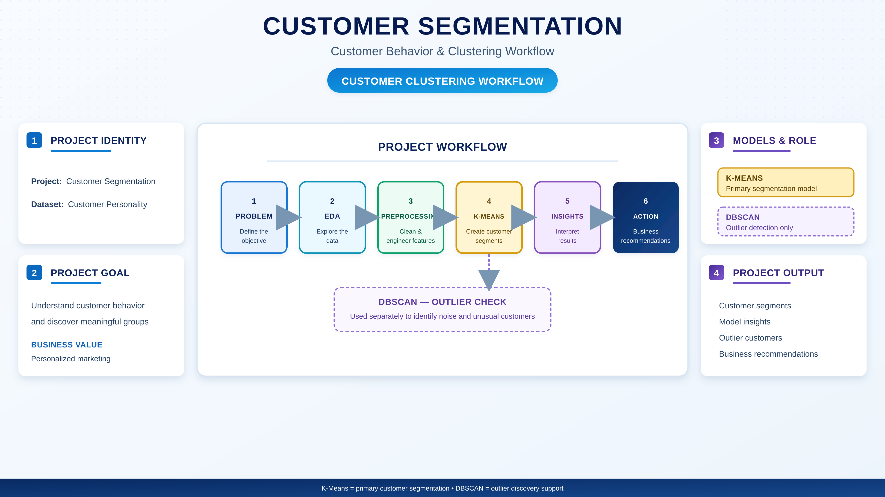
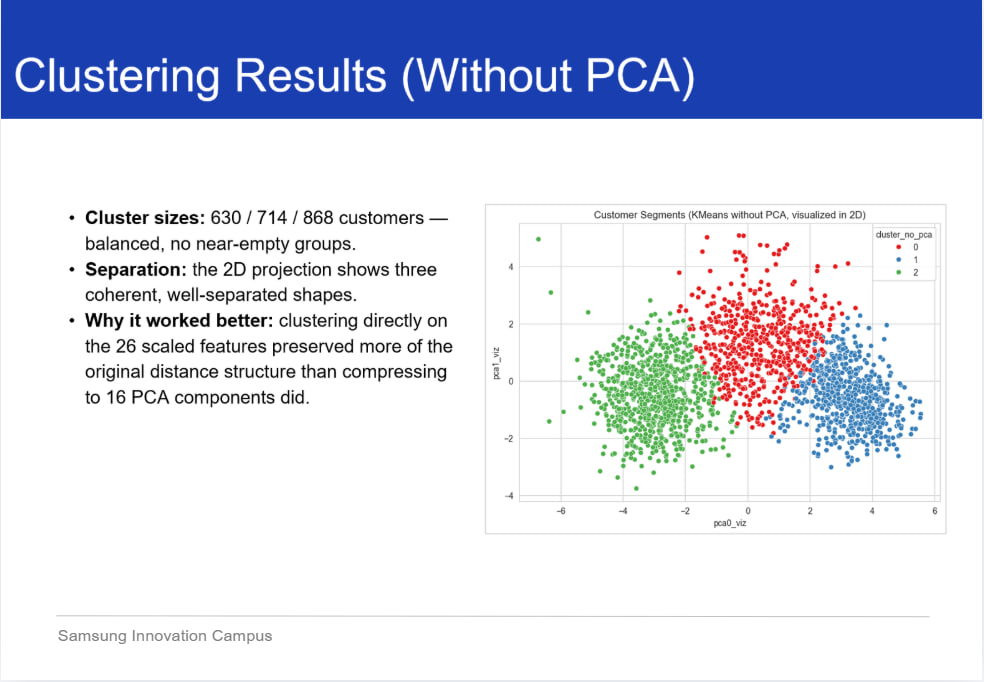
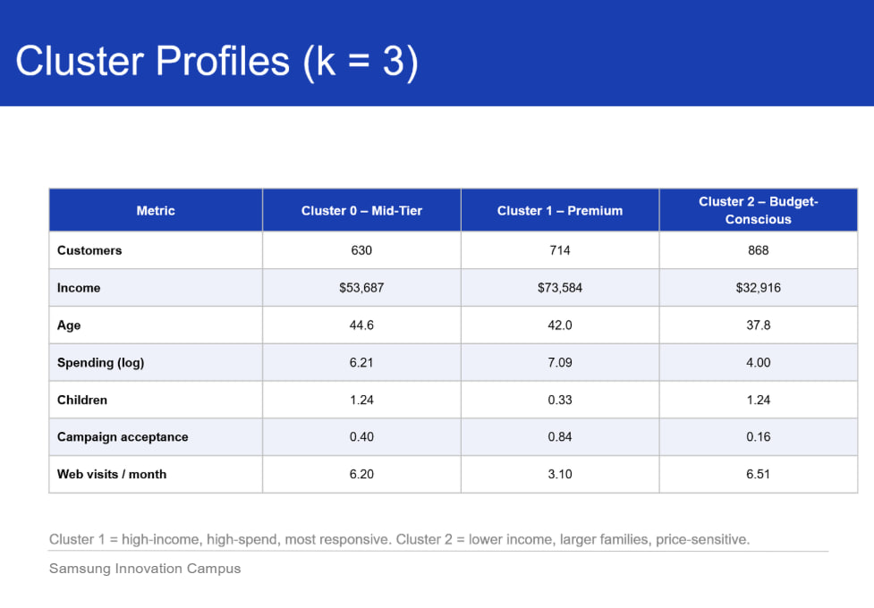
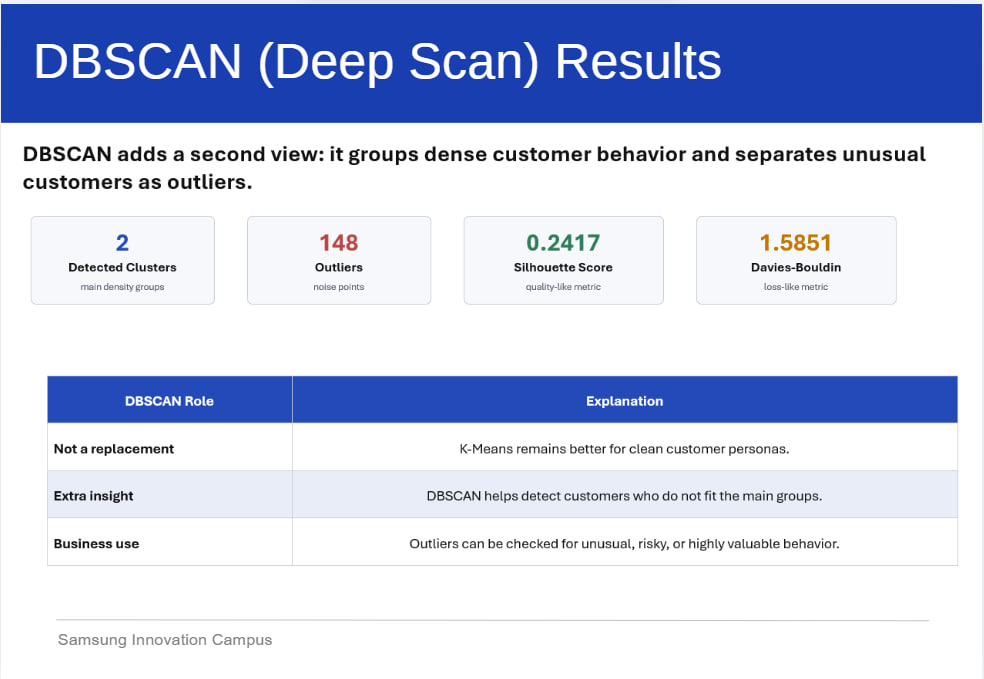

# Customer Segmentation

[](image/showcase.png)

## Table of Contents

- [Project Mission](#project-mission)
- [About the Project](#about-the-project)
- [Dataset](#dataset)
- [Data Cleaning & Feature Engineering](#data-cleaning--feature-engineering)
- [Clustering Approach](#clustering-approach)
- [Results](#results)
- [DBSCAN — Outlier Detection](#dbscan--outlier-detection)
- [Key Insights](#key-insights)
- [Tech Stack](#tech-stack)

---

## Project Mission

Help businesses move away from one-size-fits-all marketing by grouping customers into distinct, actionable segments based on their real behavior.

## About the Project

This project applies unsupervised machine learning to the Customer Personality dataset to uncover natural customer groupings based on income, spending, family size, and campaign responsiveness — turning raw transactional data into segments a marketing team can act on.

## Dataset

- Customer Personality dataset
- Demographics (age, income, number of children)
- Spending behavior (log-transformed)
- Marketing campaign acceptance
- Website engagement (visits per month)

## Data Cleaning & Feature Engineering

- Removed missing values and outliers
- Log-transformed spending to reduce skew
- Scaled 26 behavioral features with `StandardScaler`
- Engineered a campaign acceptance rate and web engagement metrics

## Clustering Approach

- **K-Means** as the primary segmentation model, chosen for producing clean, interpretable customer personas
- **DBSCAN** used separately as a secondary check to flag customers who don't fit the main groups
- Compared clustering directly on the 26 scaled features vs. clustering after PCA compression to 16 components — clustering on the original scaled features preserved more of the true distance structure and produced better-separated groups

[](image/kmean_without_PCA.jpg)

## Results

K-Means with **k = 3** produced three well-balanced, well-separated segments (630 / 714 / 868 customers):

[](image/customer_cluster.jpg)

| Cluster | Profile |
|---|---|
| 1 — Premium | High income (~$73.6K), highest spending, most responsive to campaigns |
| 0 — Mid-Tier | Moderate income (~$53.7K), balanced spending and engagement |
| 2 — Budget-Conscious | Lower income (~$32.9K), larger families, price-sensitive |

## DBSCAN — Outlier Detection

DBSCAN was applied as a second lens to surface customers who don't fit neatly into the main segments:

[](image/DBSCAN.jpg)

- Detected 2 dense clusters and 148 outlier customers
- Used for insight, not as a replacement for K-Means — outliers can be reviewed for unusual, risky, or high-value behavior

## Key Insights

- Income and spending are the strongest drivers of segment separation
- Premium customers respond to campaigns at nearly 2x the rate of other segments
- Budget-conscious customers have larger families and visit the website more often, despite lower spending
- DBSCAN's outlier group is a useful watchlist for customers who behave atypically


## How to Run

```bash
git clone https://github.com/yossefhaytham/Customer_Segmentation.git
cd Customer_Segmentation
pip install -r requirements.txt
jupyter notebook customer_segmentation.ipynb
```

